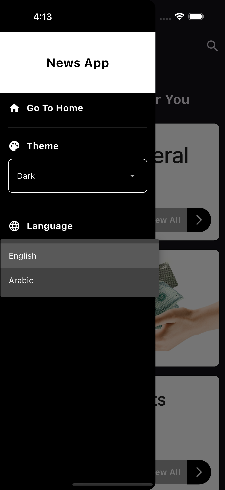
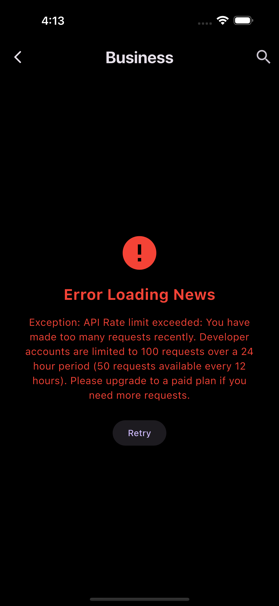
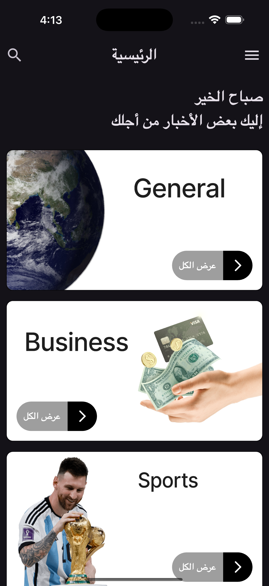
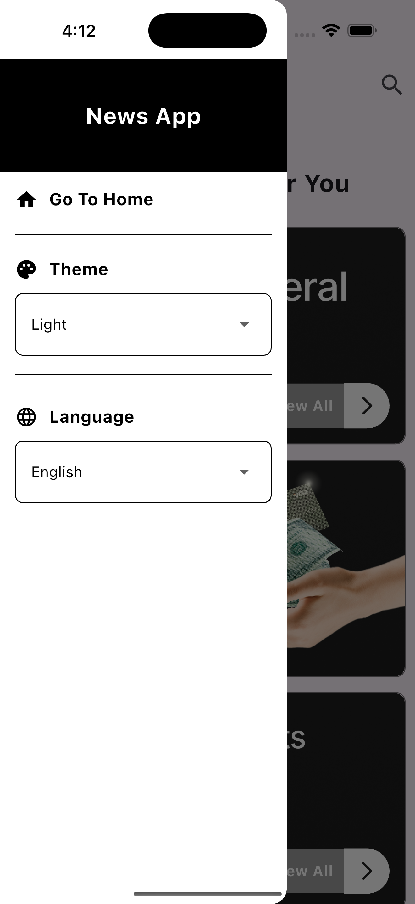

# 📰 News Application

A modern, multilingual Flutter news application with beautiful UI, theme switching, and multi-language support (English & Arabic).

## ✨ Features

### 🌍 Multi-Language Support

- **English** and **Arabic** language support
- RTL (Right-to-Left) layout for Arabic
- Seamless language switching with persistent preferences

### 🎨 Themes

- **Light** and **Dark** mode
- Smooth theme transitions
- Adaptive UI based on selected theme

### 📱 Categories

Browse news by categories:

- 📰 General
- 💼 Business
- ⚽ Sports
- 🏥 Health
- 🎬 Entertainment
- 💻 Technology
- 🔬 Science

### 🎯 Key Features

- Clean and modern Material Design UI
- Category-based news browsing
- Drawer navigation menu
- Search functionality (UI ready)
- Responsive design
- State management with Provider
- Localized content for all supported languages

## 🖼️ Screenshots

<div align="center">

### Home Screen (Light Mode)



### Home Screen (Dark Mode)



### Category Page



### Arabic Language Support



### Drawer Menu


</div>

## 🚀 Getting Started

### Prerequisites

- Flutter SDK (3.8.1 or higher)
- Dart SDK
- Android Studio / VS Code
- iOS Simulator / Android Emulator

### Installation

1. **Clone the repository**

   ```bash
   git clone https://github.com/yourusername/news_application.git
   cd news_application
   ```

2. **Install dependencies**

   ```bash
   flutter pub get
   ```

3. **Generate localizations**

   ```bash
   flutter gen-l10n
   ```

4. **Run the app**
   ```bash
   flutter run
   ```

### Build for Production

**Android:**

```bash
flutter build apk --release
```

**iOS:**

```bash
flutter build ios --release
```

## 📂 Project Structure

```
lib/
├── api/                      # API services and endpoints
├── constants/               # App constants, theme, routes
│   ├── app_colors.dart
│   ├── app_routes.dart
│   ├── locale_provider.dart
│   └── theme_provider.dart
├── l10n/                    # Localization files
│   ├── app_en.arb
│   └── app_ar.arb
├── models/                  # Data models
│   ├── article_model.dart
│   ├── category_model.dart
│   └── source_model.dart
├── pages/                   # App screens
│   ├── home_page.dart
│   └── category_page.dart
├── utils/                   # Utility functions
│   └── format_date.dart
├── widgets/                 # Reusable widgets
│   ├── menu_drawer.dart
│   ├── news_widget.dart
│   └── view_all_button.dart
└── main.dart
```

## 🛠️ Technologies Used

- **Flutter** - Cross-platform UI framework
- **Provider** - State management
- **http** - HTTP client for API calls
- **cached_network_image** - Image caching
- **intl** - Internationalization
- **flutter_localizations** - Localization support

## 🎨 Architecture

The app follows a clean architecture pattern:

- **Presentation Layer**: Pages and Widgets
- **Business Logic**: Providers (State Management)
- **Data Layer**: API services and Models
- **Localization**: ARB files for i18n

## 🌐 Localization

The app supports multiple languages through ARB (Application Resource Bundle) files:

- `app_en.arb` - English translations
- `app_ar.arb` - Arabic translations

Add new translations by editing these files and running `flutter gen-l10n`.

## 🎭 Customization

### Adding a New Language

1. Create a new ARB file: `lib/l10n/app_xx.arb` (xx = language code)
2. Add the `@@locale` attribute
3. Add translations for all keys
4. Update `lib/l10n/l10n.dart` to include the new locale

### Adding a New Theme

1. Edit `lib/constants/theme.dart`
2. Add new theme definitions
3. Update theme provider logic

## 📝 API Configuration

The app uses NewsAPI. To use your own API:

1. Get your API key from [NewsAPI](https://newsapi.org/)
2. Update `lib/api/api_constants.dart` with your API key

## 🤝 Contributing

Contributions, issues, and feature requests are welcome! Feel free to check the issues page.

## 📄 License

This project is licensed under the MIT License - see the [LICENSE](LICENSE) file for details.

## 👨‍💻 Author

**Your Name**

- GitHub: [@yourusername](https://github.com/yourusername)
- Email: your.email@example.com

## 🙏 Acknowledgments

- NewsAPI for providing news data
- Flutter team for the amazing framework
- All contributors and users of this project

---

Made with ❤️ using Flutter
